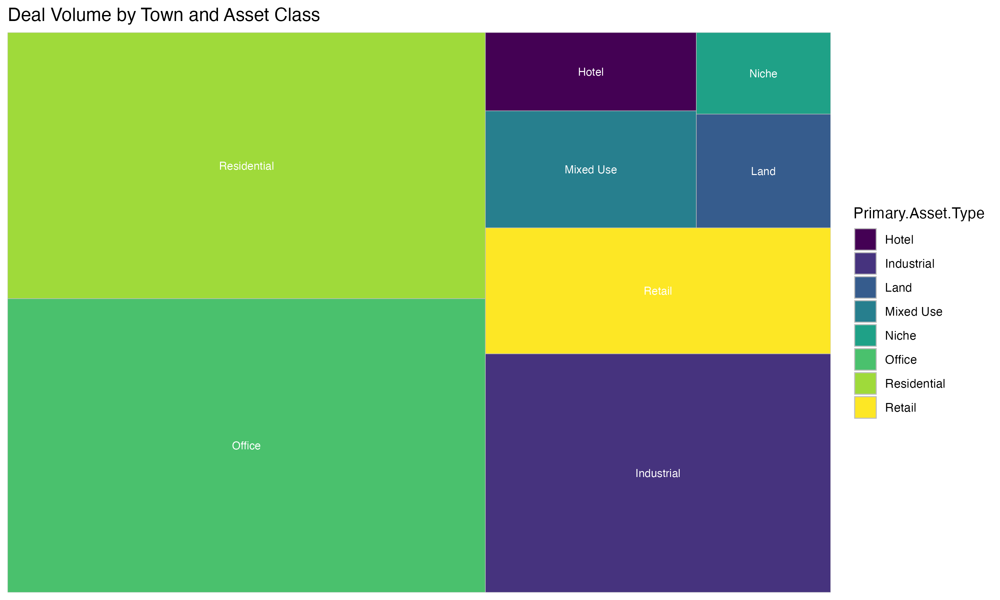
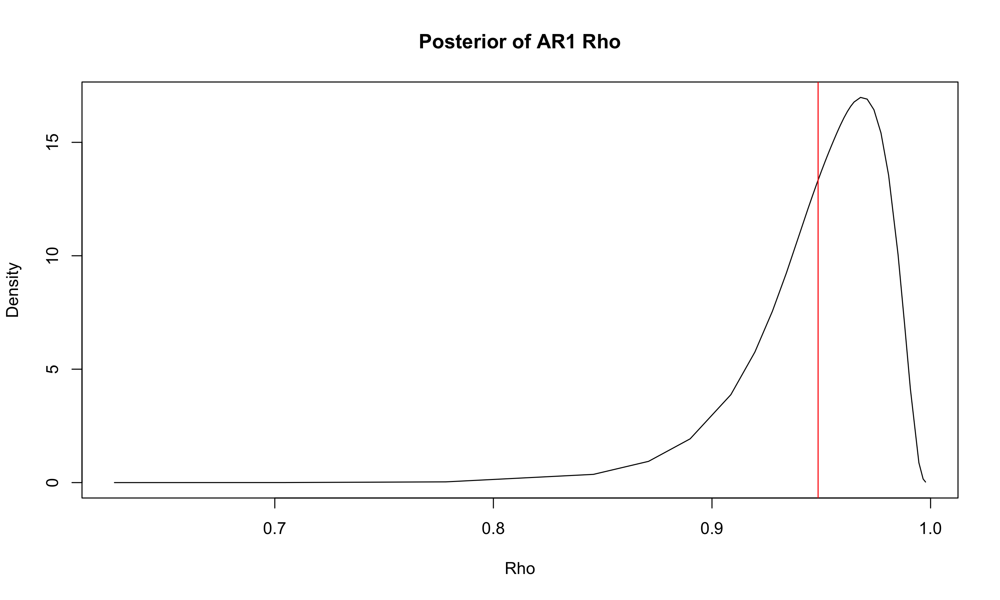
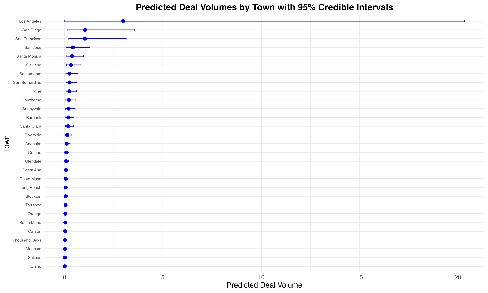

```{r setup, include=FALSE}
knitr::opts_chunk$set(echo   =FALSE,      ## show or suppress the code
                      include=TRUE ,      ## show or suppress the output
                      message=FALSE,      ## omit messages generated by code
                      warning=FALSE,      ## omit warnings generated by code
                      comment=NA,         ## removes the ## from in front of outputs
                      fig.align="center", ## centers all figures
                      fig.height = 5,     ## set the default height
                      fig.weight = 5      ## set the default width
                      )
```

## Abstract

Opportunistic real estate investors look to find markets which exhibit favorable conditions for future returns. While some characteristics are more tangible and property specific, such as low property prices or high capitalization rates (cap rates), others are more abstract, such as the overall economic health of a region, or characteristics of the local population. In this project, we aim to uncover what drives institutional investor deal volume in California over time, with the goal of being able to identify regions that exhibit positive qualities for investment. We employ a variety of datasets, using real estate investment deals from Preqin (to approximate Deal Volume, the outcome variable), and economic and societal predictors from the U.S Census Bureau, Bureau of Labor Statistics, Zillow, and the Interal Revenue Services of the United States. We build a spatio-temporal model to predict Deal Volume in a 6-month time period, which accounts for the various economic predictors, but also for the spillover effects from nearby towns, as well as the time effect of previous deal flow on future deal flow. We find that an areas Unemployment Rate, Median Household Income and the overall Federal Funds Rate strongly signal lower deal flow, an area's population that has Welfare Benefits, Private Health Insurance, and higher Home Values signal higher deal flow, and that the time effect of previous deal flow is a strong predictor of future deal flow. While predictive power of the model is weak, we show that San Diego could be considered to be a good opportunistic investment in 2024. Overall, results from this model show that macroeconomic effects are primarily responsible for an areas investment, but there are interesting societal characteristics that seem to be desired (either purposefully or inadvertently by investors).

An overview of your report, including one or so sentences on each of these:

- a non-technical description of the problem you are trying to solve or the question you are trying to answer, and why you are trying to answer that question X
- a non-technical description of the data, where it came from, and what it contains, including possibly the predictors, the outcome, and the observations X
- a non-technical description of what kind of analysis you did, including high-level description of what the predictors were, what the outcome was, and how to interpret the results of the model X
- a brief summary of the models that are used X
- a non-technical description of the results of the model and main takeaways. X

An abstract is one paragraph with text only and is aimed at a technical audience. This appears at the beginning of the report.

## Executive Summary
An executive summary is typically longer than the abstract, up to a page, could possibly contain key visualizations, tables, or other figures that help communicate either the raw data or the results of the model, and is intended for someone outside of the data science/analytics team of an organization. It is important to be as concise as possible, and describe each of those points above without using language that is overly technical and not part of commonly used English. The executive summary is a separate document. 

Note that in the abstract, executive summary, and throughout the report you should avoid using first-person singular pronouns like "I" and "me", even if you are the only author. Use "we" or use passive voice. 

## Introduction 

An opportunistic investment in real estate is a process in which an asset is able to be purchased at a price that is less than its intrinsic value. This dislocation can be due to a variety of reasons: distressed sellers looking to dump assets, a neighborhood's poor reputation driving down prices, complexity of modeling future cash flows, etc. Real estate investment firms can be split into two categories, opportunistic and core.

A core real estate investor will look to invest in assets that are in prime locations, have stable cash flows, and are generally considered to be low risk. These investors are looking for a steady return on their investment, and are willing to pay a premium for the stability of the asset. As an investor in this firm, you will expect to have general exposure to the real estate market as whole. 

An opportunistic investor, on the other hand, is looking for assets that are undervalued, have the potential for high returns, and are generally considered to be higher risk. These investors are looking for a higher return on their investment, and are willing to take on more risk in order to achieve that return. Skilled investors will be able to achieve significant outperformance of the general real estate market. 

The playbook for an opportunistic investor often entails them parachuting into new, relatively niche markets where there appear to be market dislocations. But, what are the signals for investors that indicate that an area is home not only to mispriced assets, but also the opportunity to drive returns over a time period? Are these indicators purely macroeconomic, or is there a possibility that an information advantage, perhaps through data, to find opportunistic markets? These are the questions which we seek to answer in this analysis.

When thinking about this problem, one cannot ignore two primary factors: time and location. Time is of the essence when identifying undervalued markets - with billions of dollars at the command of investors looking for these opportunities. Therefore, the effect of previous time periods of investment has significant impact on future near term investment. Next, location cannot be considered to be independent. Characteristics of a city, such as its economic health, the health of its population, are often correlated with that of nearby areas, meaning that real estate investment in one city can be captured by another.

To combine the influences of space and time alongside the predictors in our model, we employ the INLA (Integrated nested Laplace approximation) spatio-temporal model. The INLA model allows us to estimate the posterior distribution of fixed effects (like our economic predictors), and random effects (spillover effects, time ), and therefore understand their contribution of these effects to deal volume. Specific building of the model is discussed further in the paper. Given the computational complexity of the model, we limit our analysis to the state of California - which we believe to be comprehensive given its size and diversity of markets. 

While the most tangible data points sound real estate investment are often property specific, this information is often not publicly available, and costly to obtain from brokers or private sources. Therefore, we look to find macroeconomic and socioeconomic, publicly available predictors that real estate investors have historically found (either purposefully or inadvertently) to signal an opportunistic. We detail the data sources and predictors below. Based on data availability, we limit our analysis from January 2010 to June 2023.

## **1. Preqin Data**
- **Description**: This dataset contains deal-level information for the state of California, including details such as deal name, date, type, location, and asset attributes. Data ranges from early 1990 to October 2024.
### **Primary Variables Used**:
- **Asset Type:** Type of assets include Residential, Retail, Industrial, Office, Niche, Land, Hotel, and Mixed Use  
- **Asset City:** City where the asset is located
- **Deal Volume** (Outcome Variable) Aggregate number of deals per city in 6-month period

## **2. Bureau of Labor Statistics (BLS) Data**
- **Description**: This dataset includes employment metrics (labor force, employment, unemployment) by geographic area. Data is collected monthly.
### **Primary Variables Used**:
- **Unemployment Rate:** Percentage of unemployed individuals in the labor force.

## **3. Federal Reserve Data**
- **Description**: Time series data for federal interest rates. Data is collected monthly. 
### **Primary Variables Used**:
- **Federal Funds Rate:** Interest rate at which depository institutions lend reserve balances to other depository institutions overnight.

## **4. Zillow Data**
- **Description**: This dataset contains Zillow Home Value Index (ZHVI) for single-family homes and condos. According to Zillow, the ZHVI reflects the typical value for homes in the 35th to 65th percentile range. Data is collected monthly.
### **Primary Variables Used**:
- **Home Value:** Median home value for single-family homes and condos.

## **5. ACS (American Community Survey) Data**
- **Description**: Contains demographic and economic metrics for cities across California, such as median household income, health insurance coverage, job status, and more. Data is collected annually.
### **Primary Variables Used**:
- **Median Household Income:** Median income of households in a city.
- **Welfare Benefits:** Total population receiving public assistance (Foodstamp/SNAP benefits, Public Assistance)
- **Health Insurance:** Total population with private health insurance coverage, and total population without any health coverage. 
- **Government Benefits:** Total population receiving government benefits (Social Security, SSI, Veterans, Medicare, etc.)
- **Job Type:** Total population by job type. Grouped by "White Collar", "Blue Collar", "Other" within the analysis. 
- **Transportation Method:** Total population in possession of a car, and population of those taking other primary transportation methods (public transport, carpooling, etc.). 
-**Mean Travel Time to Work:** Average travel time to work for the population in a census area.
-**Work from Home:** Total population working from home.
-**Unpaid Family Workers:** Total population working as unpaid family workers.Defined as an individual who works without pay for 15 or more hours a week in a family owned and operated business.

## **6. Interal Revenue Services (IRS) Opportunity Zone Data**
- **Description**: Spatial data for designated Opportunity Zones in California. The IRS designates an Opportunity Zone as "an economically-distressed community where new investments, under certain conditions, may be eligible for preferential tax treatment." Data is only available as of 2019.
### **Primary Variables Used**:
- **Opportunity Zone:** Binary variable indicating whether a city is designated as an Opportunity Zone as of 2019.

- a few sentences or a paragraph describing what is contained in the rest of the paper, including make steps and main takeaways. 

One possible way to do this is to include roughly one sentence per section, that describes what is in the section and the main takeaways from each section.  For example, 

> "Section 2 contains data exploration and visualization, which reveals that *****.  In Section 3, we build several different predictive models and find that *****. We discuss the results of the model, including *****, in Section 4. Finally, we discuss conclusions, recommendations and ideas for future work in Section 5."

You will see this in many research articles. It can seem formulaic, so if you have an alternative way to summarize the remainder of the article, go for it. 

There are similarities between the introduction and the abstract. The introduction is longer and more detailed, especially in terms of background, previous work, and motivation of the problem, and contains a brief outline of the contents of the rest of the paper. 

You might find these resources useful as well, courtesy of the Poorvu Center for Teaching and Learning

- [Research paper writing in the Natural Sciences](https://poorvucenter.yale.edu/sites/default/files/files/Schultz_ResearchPaper_NaturalSciences_formatted.pdf)
- [Research paper writing in the Humanities](https://poorvucenter.yale.edu/sites/default/files/files/LPaul_Humanities.pdf)

## Data exploration and visualization 

### Visualizing the Preqin Dataset

We begin our analysis by examining the Preqin data, in order to understand how deal volume changes over time within California.

```{r fig29, echo=FALSE, out.width='80%', out.height='60%', fig.cap ="Overall Deal Volume over Time"}
knitr::include_graphics("figures/fig29.png")
```

While one would expect that deal volume would decline sharply during the onset of the COVID-19 pandemic, it is evident from the figure that Deal Volume in California reduced sharply in 2018. While we could not find any glaring factor that would cause this reduction, we know that this behavior is likely not due to missing data, since for other states within the Preqin dataset, Deal Volume remains stable until 2020.

Therefore, some potential reasons for this could be: genral uncertainty surrounding interest rates in 2018 curbing homeowner demand, bottoming out of housing affordability in 2018 (California Association of REALTORS, 2018), or uncertainty surrounding the voting of Proposition 10, which would have allowed local governments to enact rent control on any type of rental housing.

We can further visualize this graphically as follows:

```{r fig4, echo=FALSE, out.width='80%', out.height='80%', fig.cap ="Overall Deal Volume over Time"}

```
Here, we can see that the majority of our data is split between the northern and southern ends of the state, and largely coastal. From this, we can see that the larget cities by deal volume are Los Angeles, San Diego, and San Francisco. The close proximity of townships to eachother further emphasizes our need to utilize spatial correlation in our model.

Moving on, we look to see the distribution of deals across asset class, and if there are types of real estate that are particularly popular within California.

\clearpage

```{r fig1, echo=FALSE, out.width='100%', out.height='100%', fig.cap ="Deal Volume by Asset Type"}

```

Here, the majority of deals are made up of residential and office spaces. This is not surprising, given that these are the most common types of real estate in California. However, it is possible that in the post COVID-19 that office will be a less popular asset type, given the rise of remote work. We will examine how work-from-home population in an area affects deal volume in the modeling portion of this analysis.

\clearpage
We also look to see if this deal volume is focused in any specific cities. We create the heatmap below for the 25 cities with the most deals in California for readability.

```{r fig2, echo=FALSE, out.width='100%', out.height='100%', fig.cap ="Deal Volume, by City and Year"}

```

Here, we can see that the vast majority of deals are located in Los Angeles, San Diego, and San Francisco, seen in the yellowish colors in the top. The visualization aligns with previous reasoning of the peak deal volume occurring pre-2018. In this graph, we do see that towns like Hawthorne have seen an increase in deal activity over the past 5 years.

### Visualizing the Economic Predictors

We now move on to visualize the economic predictors that we will use in our model. First, we will examine their effects graphically. While we only include a 2 of the strongest predictors here, the rest of the strongest predictors are within the codefile, under "figures".

\clearpage

```{r fig_side_by_side, echo=FALSE, fig.cap="Scaeld Predictors Vs. Deal Volume", out.width="100%", out.height = "100%", fig.show='hold'}
par(mfrow=c(1,2))
knitr::include_graphics(c("figures/fig6.png", "figures/fig5.png"))
```

From this plot, we can deduce several relationships. 
\clearpage

In these two plots we can see HomeValue and Unmployment Rate by Town, and how they are potentially related to large deal volumes. For HomeValue, we can see that the highest valued properties in California are in the Bay Area, and do command a sizeable Deal Volume. However, lower valued properties in the San Diego and Los Angeles area also command a sizeable Deal Volume. For Unemployment Rate, we can see that the lowest unemployment rates are in the Bay Area, with higher rates in the South. 

The relationship between Unemployment Rate and HomeValue is clear (lower unemployment, higher home values). However, it is difficult to discern the relationship they have to deal volume.

For our last plot, we will observe scatterplots for each strong predictor against Deal Volume. We note that the predictors have been scaled, by subtracting the mean and dividing by the standard deviation of each predictor across all deals. In addition, for interpretability, the y axis is the log of the Deal Volume.

```{r fig12 , echo=FALSE, fig.cap="Unemployment Rate, Home Value by Town", out.width="100%",fig.show='hold'}

```

From this plot, we can deduce several things. First, the existence of a single outlier often throws off what would be an approximately linear relationship to create an inverted parabola shape. This outlier is likely Los Angeles, and its position not along a linear curve suggests that for large areas, the relationship between predictors and log Deal Volume is not linear.

If we ignore the outlier, we can some relationships within the data. Notably, there appear to be approximately positive effects of Blue Collar population, no Health Insurance and Private Health Insurance population, Other Transport (i.e public transit usage), Work from Home population, Unpaid family worker population, and Government Benefits population on Deal Volume.

Unemployment Rate, Travel Time to Work appear to be negative contributors, with Federal Interest Rate, Home Value, and Median Household Income having a more difficult to discern relationship with Deal Volume.

Now that we have introduced our predictors, we will move on to the formation of our model.

## Modeling/Analysis
Describe regression or classification model(s) used, or the analysis that was performed. For each regression or classification model, discuss 

We employ an INLA spatio-temporal model to predict Deal Volume for a town in a six month time period. Since we are modeling count data over a period of time, the model can be viewed as a Poisson regression model with a spatio-temporal component. Therefore the model is as follows:

### Assumptions

1. **Poisson Distribution:** The model assumes that the number of deals in each town and period follows a Poisson distribution, meaning the variance equals the mean.
2. **Linearity on the Log Scale:** Predictors enter the model linearly on the log scale (log-link function).
3. **Spatial and Temporal Structure:** The model includes spatial random effects, assuming towns closer together share similar deal patterns, and temporal random effects, assuming that the number of deals in one period is correlated with the next.
4. **No Excess Zeros or Overdispersion Unaccounted For:** The model assumes the Poisson distribution is appropriate, i.e., no significant zero-inflation or more variability than Poisson allows. Given the nature of the data (i.e) sparse deal flow for many towns across long periods, we will explore the use of a zero-inflated Poisson model.

### Observation, Predictors, and Outcome

- **Observations:** Each row represents a particular town and period combination.
- **Predictors (Columns of \( X \)):** These include scaled economic indicators (e.g., `Fed_Rate_scaled`, `Unemployment_Rate_scaled`, `HomeValue_scaled`), demographic measures (e.g., `Estimate.Worked.at.home_scaled`), and other socio-economic variables. Each predictor is a column in \( X \).
- **Outcome (y):** The response \( y \) is the count of deals observed for that town and period.

The INLA model is a way to incorporate the spatial and temporal effects into a standard Poisson regresion model. Therefore, we can stylize the equation as:

\[
\log(\lambda_{it}) = \beta_0 + \beta_1 X_{1,it} + \beta_2 X_{2,it} + \cdots + \beta_p X_{p,it} + u_{space,i} + v_{time,t}
\]

where:
- \(\lambda_{it}\) is the expected deal volume for town \( i \) at time \( t \).
- \(\beta_j\) are the fixed-effect coefficients for each predictor.
- \(u_{space,i}\) is the spatial random effect for town \( i \).
- \(v_{time,t}\) is the temporal random effect for period \( t \).

### Interpretation of the Coefficients

A coefficient \(\beta_j\) corresponds to the expected change in the log of the deal count per unit increase in that predictor, holding others constant. 

- **Positive \(\beta_j\):** Increasing the predictor is associated with higher predicted deal volumes.
- **Negative \(\beta_j\):** Increasing the predictor is associated with fewer deals.

### Hyperparameters

The model includes hyperparameters associated with the spatial and temporal random effects:

- **Spatial Hyperparameters:**
  - **Range for spatial.field (\(\theta_{\text{range}}\)):**  This parameter indicates how far spatial correlation extends; a larger range means that towns farther apart still share some similarity in deal volumes. We choose to measure this in meters.
  - **Precision for Period (\(\tau_{\text{Period}}\)):** Precision is the inverse of variance; higher precision indicates less variability in the temporal random effects.
  - **Rho for Period (\(\rho_{\text{Period}}\)):** An autoregressive parameter - when close to 1 this suggests strong temporal correlation, meaning that deal volumes in one period are highly related to those in the subsequent period.

### Performance Measures

- **Fit Measures:** 
  - **DIC (Deviance Information Criterion):** Provides a measure of model fit that accounts for model complexity. Lower values indicate a better fit.
  - **WAIC (Watanabe-Akaike Information Criterion):** Another fit measure that assesses predictive accuracy. Lower values are better.

- **Predictive Ability:** 
  - **Residual Analysis:** Assessing residuals to identify patterns not captured by the model. We can also use this to test overdispersion.

- **Marginal Log-Likelihood:** Can be used for model comparison - higher (less negative) values generally indicate a better-fitting model.


### Model Appropriateness

This Poisson model with spatial and temporal random effects is suitable if the data follow a count distribution with no severe overdispersion or zero-inflation. The presence of correlated measurements across towns and over time is well-handled by the spatial and temporal effects. 

- **Appropriate If:**
  - The mean and variance of the deal counts are approximately equal.
  - Spatial and temporal correlations exist and are significant.
  
In our data, there are a high amount of zeroes. We therefore test a zero-inflated Poisson model to account for this.

### Ease of Interpretation

While the formulation of the INLA model is quite complicated and difficult to explain even to a technical audience, the interpretation of its results are fairly straightforward - they can be viewed like a Poisson GLM with fixed and random effects (which are spatial and temporal).

For a non-technical audience, the signs and magnitude of predictors are able to explain positive or negative effects on the outcome variable. While the spatial and temporal effects are more difficult to explain, they can be understood as the effect of nearby towns and previous time periods on deal volume - and can be explained fairly simply through the values of the hyperparameters $\theta_{\text{range}}$, $\tau_{\text{Period}}$, and $\rho_{\text{Period}}$.

## Modeling Process

To decide on the use of variables, Lasso regression was employed to aid in variable selection.

To build the model, the process detailed in (Wilke et. al, 2019, pg. 169) was employed. To capture spatial dependencies, we use an SPDE (Stochastic Partial Differential Equation) model. Then, we encode the temporal dynamics using a first-order autoregressive model. The results from these models are simply fed in as parameters to the INLA model.

Following this, an iteration over all predictor combinations within the INLA model was used, and the subset of predictors that achieved lowest WAIC was chosen as the best set.

## Visualization and Model Results

The results of the INLA model fit on the chosen predictors by minimizing WAIC are as follows:

```{r fixed-effects-table, echo=FALSE, message=FALSE}
# Load necessary library
library(knitr)
library(kableExtra)

fixed_effects <- data.frame(
  `Predictor (Scaled)` = c(
    "Fed Rate",
    "Unemployment Rate",
    "Home Value",
    "Population Work From Home",
    "Mean Travel Time to Work",
    "Unpaid Family Workers",
    "Median Household Income",
    "Population Private Health Insurance",
    "Population No Health Insurance",
    "Opportunity Zone",
    "Other Transportation",
    "Ppulation Blue Collar",
    "Population w/ Govt Benefits ",
    "Population w/ Welfare Benefits"
  ),
  Mean = c(
    -0.591,
    -0.612,
    0.208,
    -0.153,
    0.112,
    -0.034,
    -0.151,
    0.573,
    0.051,
    0.148,
    -0.047,
    0.042,
    -0.088,
    0.239
  ),
  SD = c(
    0.134,
    0.098,
    0.044,
    0.046,
    0.081,
    0.024,
    0.106,
    0.213,
    0.025,
    0.089,
    0.033,
    0.033,
    0.047,
    0.053
  )
)

# Generate the table with corrected alignment
kable(
  fixed_effects,
  caption = "Fixed Effects - Mean and Standard Deviation",
  align = "lcc",  # Corrected alignment: left, center, center
  col.names = c("Predictor", "Mean", "SD")
) %>%
  kable_styling(full_width = FALSE, position = "center")
```
```{r model-parameters-table, echo=FALSE, message=FALSE}
# Create a data frame for Model Hyperparameters and Criteria
model_parameters <- data.frame(
  Parameter = c(
    "Range for Spatial Field",
    "Precision for Period",
    "Rho for Period",
    "Deviance Information Criterion (DIC)",
    "Watanabe-Akaike Information Criterion (WAIC)",
    "Marginal Log-Likelihood"
  ),
  Mean = c(
    "2.01e+04",
    0.656,
    0.949,
    5198.07,
    5205.21,
    -2811.69
  )
)

# Generate the table with corrected alignment
kable(
  model_parameters,
  caption = "Model Hyperparameters and Criteria",
  align = "lc",  # Corrected alignment: left, center
  col.names = c("Parameter", "Mean")
) %>%
  kable_styling(full_width = FALSE, position = "center")
```

The magnitude of the fixed effects predictors above can be represents the change in the log of the expected deal volume for a one unit change in that predictor.

From the table above, we can see that the strongest positive contributors of Deal Volume is Population Private Health Insurance (.573), Home Value (.208), Population with Welfare Benefits (.239), and Opportunity Zone (.148).

Some possible interpreations for the direction of these coefficeints are as follows:
- **Population Private Health Insurance (.573):** A higher proportion of residents with private health insurance may indicate greater economic stability and disposable income, good indicators for renters, offices, etc.
- **Home Value (.208):** Higher home values reflect a prosperous area, with buyers that are willing to pay high prices
- **Population with Welfare Benefits (.239):** Areas with high welfare benefits might contain undervalued properties in neighborhoods that are on the rise
- **Opportunity Zone (.148):** Designation as an Opportunity Zone provides tax incentives, encouraging investors to engage in more deal transactions within these areas

Conversely, the strongest negative contributors are Unemployment Rate (-.612), Median Household Income (-.151), and Federal Funds Rate (-.591).

Some possible interpretations for the direction of these coefficients are as follows:
- **Unemployment Rate (-.612):** High unemployment rates may indicate economic instability, lack of disposable income, higher delinquency rates from renters, leasers
- **Median Household Income (-.151):** Lower median household incomes may indicate less disposable income for residents to invest in real estate
- **Federal Funds Rate (-.591):** Higher interest rates may discourage borrowing and investment in real estate

For the hyperparameters, we see that the range for the spatial field is 20,000 meters. This means that spatial correlation in deal volumes extends up to 20 kilometers, indicating that towns within this distance influence each other's deal activities. Much of the towns that lie within 20km of eachother are in the Bay Area, and greater Los Angeles.

The Rho value of .949 is very close to 1, indicating strong temporal correlation in deal volumes. This means that deal volumes in one period are highly related to those in the subsequent period. 

The DIC is 5198.07, the WAIC is 5205.21, and the marginal log-likelihood is -2811.69. These become important when we compare to other types of INLA models.

We can also visualize these results by looking at the posterior distribution of the fixed effects. The posterior distributions for the rest of the fixed effects are contained in the Appendix. 

```{r fig18, echo=FALSE, out.width='100%', out.height='100%', fig.cap ="Posterior Distribution of Fixed Effects", fig.show='hold', out.width="40%"}


```

Notably, the posterior distribution of the fixed effects appear normally distributed. This makes our statistical inferences about the fixed effects predictors more reliable.


We can also look at the distribution of the spatial and temporal hyperparameters.

```{r fig31, echo=FALSE, out.width='100%', out.height='100%', fig.cap ="Posterior Distribution of Hyperparameters", fig.show='hold', out.width="50%"}


```
Finally, we can examine the mean and standard deviation of the spatial field, which visualizes the estimated spatial effects across the geographic landscape of California towns. Speficaly, this plot reflects how each town's location alone influences its Deal Volume.

```{r fig15, echo=FALSE, out.width='48%', fig.show = "hold", fig.cap ="Spatial Effects"}


```

Here, we can see how the spatial field forms an outline of California. Within the Spatial Field Mean plot, areas surrounding San Francisco and Los Angeles have a lighter color, meaning that after accounting for all other variables, Deal Volume is higher than the overall average. It is likely that this effect is simply due to the high population density in these areas, and less of an indicator of an opportunistic market.

### Examining Predictive Power

The predictive power of the model can be assessed through the residuals. A plot of residuals vs. fitted values are as follows:

```{r fig13, echo=FALSE, out.width='100%', out.height='100%', fig.cap ="Residuals vs. Fitted Values"}


```

Based on the plot, we can see the predictive capability of the model is quite adequate. Even at large observed values, the difference between the observed and predicted value is not large, seen in the proximity of the points to the red $ y = x $ line.

There is also a clear clustering of points around the 0 observed deal volume mark, potentially signaling that our assumption of the Poission distribution might be incorrect.

We can also examine how the uncertainty in the mean fitted value changes over time.

```{r fig33, echo=FALSE, out.width='100%', out.height='100%', fig.cap ="Uncertainty in Fitted Values Over Time"}

```
In this plot, we see the uncertainity of the estimate (seen in the gray area surrouding) peaks around time period 15 at the height of the fitted deal volume. This graph is largely similar to Figure 1, the overall deal flow over time. We note positively that as mean Deal Volume increases, the variance does as well - this aligns with the assumption of the Poisson distribution.

### Testing a Zero-Inflated Model

Given the abundance of zeroes in the data, a zero-inflated Poisson model is fit within the INLA package. The model can be described as follows, 

\[
\text{Prob}(y \mid \dots) =
p \cdot \mathbb{1}[y=0] + (1-p) \cdot \text{Poisson}(y \mid y > 0)
\]

where \( p \), the probability, is a hyperparameter tuned by a Bayseian prior. We assume that y has some probability of achieving 0, p, and all other values are Poisson distributed.

The model comparison metrics from the fitted zero-inflated model are as follows:

```{r zi_model-parameters-table, echo=FALSE, message=FALSE}
# Create a data frame for Model Hyperparameters and Criteria
model_parameters <- data.frame(
  Parameter = c(
    "Deviance Information Criterion (DIC)",
    "Deviance Information Criterion (DIC, saturated)",
    "Effective number of parameters (DIC)",
    "Watanabe-Akaike Information Criterion (WAIC)",
    "Effective number of parameters (WAIC)",
    "Marginal Log-Likelihood"
  ),
  Value = c(
    6537.91,
    1061.09,
    102.74,
    6550.78,
    101.56,
    -3421.11
  )
)
# Generate the table with kable
kable(
  model_parameters,
  caption = "Model Hyperparameters and Criteria",
  align = "lc",  # Align first column left, second column center
  col.names = c("Parameter", "Value")
) %>%
  kable_styling(full_width = FALSE, position = "center")

```

Given that the zero-inflated model has a higher DIC and WAIC, as well as more negative log-likelihood, it can be concluded that the original Poisson model is more appropriate for our data. 

Finally, a negative binomial model was tested, in case there existed overdispersion in the model that would violate assumptions of the Poisson. The results from the model are as follows:
```{r nb_model-parameters-table, echo=FALSE, message=FALSE}
model_hyperparameters <- data.frame(
  Parameter = c(
    "Deviance Information Criterion (DIC)",
    "Deviance Information Criterion (DIC, saturated)",
    "Effective Number of Parameters (DIC)",
    "Watanabe-Akaike Information Criterion (WAIC)",
    "Effective Number of Parameters (WAIC)",
    "Marginal Log-Likelihood"
  ),
  Value = c(
    "5542.79",
    "1927.04",
    "123.83",
    "5502.35",
    "78.44",
    "-2935.04"
  )
)
```
The negative binomial model also had a higher DIC and WAIC, and more negative log-likelihood, than the Poisson model. Therefore, the Poisson model is the still the most appropriate for our data.

The following predictive modeling procedure continues with the Poisson model.

## Predictive Modeling

To examine the predictive power of the model, as well as identify potential opportunistic markets, deal data is utilized from June 2023 to January 2024. For all predictor data obtained from the BLS, Federal Reserve, and Zillow, there are available values for this time period. For the census data, the 2024 year is approximated using using the growth rate of the same data point from 2018 to 2023. For those with missing values (perhaps from not being in the census until later), they are assigned the median growth rate. For towns with very large growth rates (usually caused by under reporting in 2018), they are assigned the growth rate of the .75 quartile.

The model is then fit on this mixed of projected and real data, and the predicted deal volume is calculated for each town. 

The distribution of predicted values for towns that had deal flow from June 2023 to January 2024 are shown for clarity.

```{r fig34, echo=FALSE, out.width='100%', out.height='100%', fig.cap ="Predicted Deal Volume Distribution"}

```
In this plot, towns with the highest predicted deal volume also have extremely wide confidence intervals. It appears that variance is greater than the mean in this sense, suggesting that the Poisson distribution might be violated for the predicted values.

We can visualize the predicted values relative to the actual deal flow within the period from June 2023 to January 2024 in the following plot. Here, Predicted_Upper refers to the .975 quartile of predicted values.

```{r fig35, echo=FALSE, out.width='100%', out.height='100%', fig.cap ="Predicted vs. Actual Deal Volume"}

```

For Los Angeles, the .975 quantile actually closely fits the data, suggesting that the model is able to predict the deal volume in this area. The majority of other towns have much greater actual deal volume than predicted.

We can visualize this distribution across the map:

```{r fig36, echo=FALSE, out.width='100%', out.height='100%', fig.cap ="Future Deal Volume by Town"}

```

From the plot, we can see that San Diego and Los Angeles are the only towns in which the .975 quartile Deal Volume is greater than the actual. San Diego, in particular, has a mean predicted value quite close to the actual. Perhaps this indicates that the area can be considered opportunistic.

## Conclusions and recommendations
One or two paragraphs stating conclusions, recommendations, and ideas for future work and improvements.


## References

https://www.car.org/-/media/CAR/Documents/Industry-360/PDF/Market-Data/2018-State-of-the-Housing-Market-The-SHIFT-Report--Single-Page.pdf?

Wikle, C. K., Zammit-Mangion, A., and Cressie, N. (2019), Spatio-Temporal Statistics with R, Boca Raton, FL: Chapman & Hall/CRC. © 2019 Wikle, Zammit-Mangion, Cressie. https://spacetimewithr.org


## Appendix (optional)
Any supporting information or additional information that isn't necessary to have in the main body of the paper. For example, huge tables can go here, especially if they are more than one page. Tables that are, for example, 100 pages most likely should not be included at all. 
